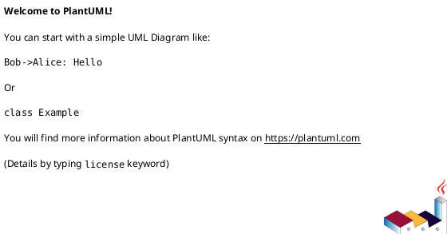
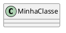
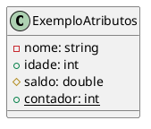
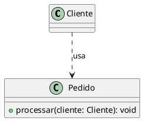

# Mini-Tutorial PlantUML: Diagramas de Classes

Este mini-tutorial visa auxiliar na criação de Diagramas de Classes UML utilizando PlantUML, uma ferramenta que permite gerar diagramas a partir de uma sintaxe textual simples.

## 1. Introdução ao PlantUML

PlantUML é uma ferramenta open-source que permite descrever diagramas UML e outros tipos de diagramas usando uma linguagem textual intuitiva. É uma excelente forma de manter a documentação do projeto atualizada e versionada junto com o código-fonte.

**Por que usar PlantUML?**
* **Código como Diagrama:** Gerar diagramas de forma programática.
* **Integração:** Ferramentas como VS Code possuem extensões que renderizam os diagramas em tempo real.
* **Versionamento:** O texto do diagrama pode ser versionado (e.g., Git) junto com o código.

**Sintaxe Básica:**
Todo diagrama PlantUML começa com `@startuml` e termina com `@enduml`.



## 2. Definição de Classes

A classe é o bloco fundamental do diagrama.

### Sintaxe Básica de Classe

Para declarar uma classe, basta usar a palavra-chave `class` seguida do nome:



### Atributos

Atributos são as características (variáveis de instância) de uma classe.

* **Declaração:** `visibilidade nome_atributo: Tipo`
* **Visibilidade:**
    * `+`: Público (`public`)
    * `-`: Privado (`private`)
    * `#`: Protegido (`protected`)
    * `~`: Pacote (`package` - menos comum em C++ direto, mas válido em UML)
* **Propriedades Especiais:**
    * `{static}`: Atributo estático
    * `{abstract}`: Atributo abstrato (raro para atributos, mais comum em métodos ou classes)



### Métodos

Métodos são as ações ou comportamentos de uma classe.

* **Declaração:** `visibilidade nome_metodo(parametros): TipoRetorno`
* **Visibilidade:** `+`, `-`, `#` (conforme atributos).
* **Métodos Virtuais Puros (Abstratos):** Essencial para o polimorfismo em C++.
    ```plantuml
    @startuml
    abstract class Forma {
        + {abstract} calcularArea(): double
    }
    @enduml
    ```
* **Métodos Estáticos:**
    ```plantuml
    @startuml
    class Matematica {
        + {static} somar(a: int, b: int): int
    }
    @enduml
    ```
* **Construtores e Destrutores:** Representados como métodos especiais.
    ```plantuml
    @startuml
    class Objeto {
        + Objeto()
        + ~Objeto()
    }
    @enduml
    ```

### Outros Elementos de Classe

* **Classes Abstratas:** Usadas para classes que não podem ser instanciadas diretamente e que contêm métodos abstratos.
    ```plantuml
    @startuml
    abstract class Animal {
        + {abstract} emitirSom(): void
    }
    @enduml
    ```
* **Interfaces:** Definem um contrato de métodos que as classes devem implementar. (Em C++ geralmente são classes abstratas com todos os métodos virtuais puros).
    ```plantuml
    @startuml
    interface IComportamento {
        + acao(): void
    }
    @enduml
    ```
* **Enums/Structs:** Podem ser representados como classes com o estereótipo apropriado.
    ```plantuml
    @startuml
    class Status << (S,Aquamarine) enum >> {
        ATIVO
        INATIVO
    }
    class Ponto << (T,#ADD1B2) struct >> {
        + x: int
        + y: int
    }
    @enduml
    ```

## 3. Relacionamentos entre Classes

Os relacionamentos definem como as classes interagem entre si.

### Sintaxe Geral

A sintaxe básica para conectar duas classes é `ClasseA -- ClasseB`.

### Dependência (`.->`)

Indica que uma classe usa outra, mas não a possui permanentemente. Geralmente, uma classe recebe um objeto da outra como parâmetro de método.



### Associação (`--`, `->`, `<-`)

Representa uma conexão estrutural entre objetos.

* **Associação Simples:** Uma linha (`--`).
    ```plantuml
    @startuml
    class Aluno
    class Disciplina
    Aluno -- Disciplina
    @enduml
    ```
* **Navegabilidade:** Setas indicam a direção do acesso.
    ```plantuml
    @startuml
    class Usuario --> Carrinho : possui
    class Produto <-- Carrinho : contém
    @enduml
    ```
* **Multiplicidade:** Indica quantos objetos de uma classe podem se relacionar com objetos da outra.
    * `1`: Exatamente um
    * `0..1`: Zero ou um
    * `1..*`: Um ou muitos
    * `0..*` ou `*`: Zero ou muitos
    ```plantuml
    @startuml
    class Departamento "1" -- "0..*" Funcionario
    @enduml
    ```
* **Rótulos (Roles):** Nomes descritivos para o relacionamento ou para o papel de cada classe.
    ```plantuml
    @startuml
    class Pessoa "1" -- "1" Carro : dirige
    Pessoa -- Carro : possui > carroDoDono
    @enduml
    ```

### Agregação (`o--`)

Um tipo especial de associação que representa um relacionamento "tem-um" (has-a) fraco. A parte (ClasseB) pode existir independentemente do todo (ClasseA).

```plantuml
@startuml
class Time "1" o-- "0..*" Jogador : tem
@enduml
```

### Composição (`*--`)

Um tipo mais forte de associação "parte-de" (part-of). A parte (ClasseB) não pode existir sem o todo (ClasseA). Se o todo é destruído, a parte também é.

```plantuml
@startuml
class Pedido "1" *-- "1..*" ItemPedido : contém
@enduml
```

### Generalização (Herança) (`<|--`)

Representa o relacionamento "é-um" (is-a), onde uma classe (filha) herda características e comportamentos de outra (pai).

* **Herança Simples:**
    ```plantuml
    @startuml
    class Animal
    class Cachorro
    Animal <|-- Cachorro
    @enduml
    ```
* **Herança Multinível:**
    ```plantuml
    @startuml
    class Veiculo
    class Carro
    class CarroEsportivo
    Veiculo <|-- Carro
    Carro <|-- CarroEsportivo
    @enduml
    ```
* **Herança de Classes Abstratas/Interfaces (Realização):** Usada quando uma classe implementa uma interface ou herda de uma classe abstrata.
    ```plantuml
    @startuml
    abstract class Forma {
        + {abstract} desenhar(): void
    }
    class Circulo {
        + desenhar(): void
    }
    Forma <|-- Circulo
    @enduml
    ```
* **Polimorfismo:** A representação de herança e métodos virtuais no diagrama ilustra a base para o polimorfismo, onde diferentes classes derivadas podem responder de maneira diferente ao mesmo método virtual.

## 4. Dicas e Boas Práticas

* **Agrupamento:** Use `package` ou `namespace` para agrupar classes relacionadas e organizar diagramas complexos.
    ```plantuml
    @startuml
    package "Módulos Core" {
        class ServicoBase
        class Configuracao
    }
    package "Módulos de Usuário" {
        class Usuario
        class Perfil
    }
    ServicoBase <|-- Usuario
    @end
    ```
* **Exportação:** Ferramentas PlantUML permitem exportar diagramas para formatos como PNG, SVG ou PDF.
* **Consistência:** Mantenha o diagrama consistente com o código implementado.