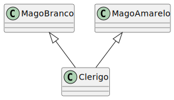
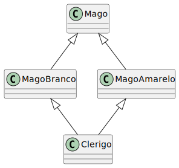

# O que é Herança Múltipla?

Em Programação Orientada a Objetos, **Herança Múltipla** é a capacidade de uma classe (classe derivada) herdar atributos e métodos de **mais de uma classe base** simultaneamente.

Diferente da herança simples, onde uma classe só pode ter um "pai" direto (por exemplo, `Mago` herda de `Personagem`), a herança múltipla permite que uma classe combine as características de vários "pais".

A ideia central é **combinar funcionalidades** e papéis, permitindo a criação de classes especializadas que são a "junção" de outras.

### Sintaxe em C++

Enquanto outras linguagens de programação orientadas a objeto, como Java e C#, optaram por não implementar a herança múltipla de classes (permitindo-a parcialmente através de um mecanismo chamado *Interface*), o C++ oferece suporte direto a ela.

A sintaxe em C++ é uma extensão natural da herança simples: basta listar as classes base separadas por vírgula.

```cpp
class ClasseBase1 { ... };
class ClasseBase2 { ... };

// Nossa classe derivada herda de AMBAS
class ClasseDerivada : public ClasseBase1, public ClasseBase2 {
    // ...
};
```

### Exemplo Prático: O Clerigo 

Vamos voltar aos exemplos de RPG. A classe `Clerigo` é uma classe de prestígio que combina duas especializações mágicas:
1.  **`MagoBranco`**: Focado em magias de proteção e luz.
2.  **`MagoAmarelo`**: Focado em magias de cura e solares.



O `Clerigo`, ao herdar de ambos, ganha acesso a todo o arsenal de feitiços das duas escolas.

Vamos ver como isso fica em código.

**`MagoBranco.h`**
```cpp
#include <iostream>
#include <string>

// (Por enquanto, vamos ignorar a classe base "Mago" para manter o exemplo focado)

// Base 1: Focada em Proteção
class MagoBranco {
public:
    void escudoDeLuz() {
        std::cout << "[MagoBranco] Cria Escudo de Luz!" << std::endl;
    }
};
```

**`MagoAmarelo.h`**

```cpp
// Base 2: Focada em Cura
class MagoAmarelo {
public:
    void curarAliado(std::string alvo) {
        std::cout << "[MagoAmarelo] Cura [" << alvo << "]." << std::endl;
    }
};
```
**`Clerigo.h`**
```cpp
// Derivada: Combina os dois papéis
class Clerigo : public MagoBranco, public MagoAmarelo {
public:
    void bencaoSuprema() {
        std::cout << "[Clerigo] Combina as duas escolas para uma Bencao Suprema!" << std::endl;
    }
};
```
**`Main.cpp`**
```cpp
int main() {
    Clerigo sacerdote;
    
    // O objeto 'sacerdote' tem acesso aos métodos de AMBAS as classes base
    
    // Método da classe MagoBranco
    sacerdote.escudoDeLuz();
    
    // Método da classe MagoAmarelo
    sacerdote.curarAliado("Guerreiro");
    
    // Método próprio
    sacerdote.bencaoSuprema();
    
    return 0;
}
````

### O Poder e o Perigo

* **Poder:** A Herança Múltipla é poderosa. Ela permite reutilizar código e criar classes complexas que agregam comportamentos de fontes distintas (como o nosso `Clerigo` que herda de `MagoBranco` e `MagoAmarelo`).

* **Perigo:** Este poder vem com um custo em complexidade. A herança múltipla pode criar **ambiguidade**. O que acontece se `MagoBranco` e `MagoAmarelo` tiverem um método com o mesmo nome, como `recuperarMana()`? Qual deles o `Clerigo` deve chamar?

* **O Maior Perigo:** O problema se agrava se ambas as classes base (`MagoBranco` e `MagoAmarelo`) herdarem, elas mesmas, de uma *mesma* classe base (como `Mago`).

**Isso é exatamente o que acontece no seu diagrama!**

Quando `Clerigo` herda de `MagoBranco` e `MagoAmarelo`, e ambos herdam de `Mago`, o `Clerigo` acaba herdando *duas cópias* do `Mago`. Isso nos leva diretamente ao **Problema do Diamante**.

---

# O Problema do Diamante (The Diamond Problem)

O **Problema do Diamante** (ou *Dreaded Diamond Problem*) é um dos problemas mais clássicos e confusos da herança múltipla. Ele é a principal razão pela qual algumas linguagens (como Java e C#) proíbem a herança múltipla de classes.

Ele acontece quando uma classe herda de duas classes que, por sua vez, herdam de uma **mesma classe base**, formando um diagrama de classes em forma de losango (ou diamante).

### O Diagrama do Diamante

Nosso exemplo dos Magos, considerando a ideia que já estudávamos em que tanto os magos brancos como os amarelos (e outras escolas) herdam de uma classe base `Mago` é um caso perfeito disso:



1.  **Topo (Base):** `Mago`
2.  **Lados (Intermediárias):** `MagoBranco` (herda de `Mago`) e `MagoAmarelo` (herda de `Mago`).
3.  **Fundo (Derivada):** `Clerigo` (herda de `MagoBranco` E `MagoAmarelo`).

### O Problema Real: Ambiguidade

Sem um tratamento especial, a classe `Clerigo` herdará **duas cópias** de tudo que está em `Mago`.

* Uma cópia virá pelo "caminho" do `MagoBranco`.
* A outra cópia virá pelo "caminho" do `MagoAmarelo`.

Isso causa dois problemas fatais:

**1. Duplicação de Atributos:**
Se a classe `Mago` tiver um atributo `int nivelDeMagia`, o objeto `Clerigo` terá *dois* atributos `nivelDeMagia`. Isso não só desperdiça memória, mas não faz sentido. Qual deles é o "verdadeiro"?

**2. Ambiguidade de Métodos:**
Se `Mago` tiver um método `restaurarMana()`, e você tentar chamar `clerigo.restaurarMana()`, o compilador C++ não saberá qual dos dois métodos `restaurarMana()` (o que veio via `MagoBranco` ou o que veio via `MagoAmarelo`) você quer executar.

### Exemplo de Código (Que Falha)

Vamos adicionar a classe `Mago` ao nosso exemplo anterior e ver o problema acontecer:

**`Mago.h`**
```cpp
#include <iostream>
#include <string>

// A classe base no topo do diamante
class Mago {
public:
    int nivelDeMagia; // O atributo duplicado

    Mago() : nivelDeMagia(1) {}

    void restaurarMana() {
        std::cout << "Restaurando Mana!" << std::endl;
    }
};
```
**`MagoBranco.h`**, agora herdando de Mago
```cpp
// Base 1: Focada em Proteção
class MagoBranco : public Mago {
public:
    void escudoDeLuz() {
        std::cout << "[MagoBranco] Cria Escudo de Luz!" << std::endl;
    }
};
```
**`MagoAmarelo.h`**, agora herdando de Mago
```cpp
// Base 2: Focada em Cura
class MagoAmarelo : public Mago {
public:
    void curarAliado(std::string alvo) {
        std::cout << "[MagoAmarelo] Cura [" << alvo << "]." << std::endl;
    }
};
```
**`Clerigo.h`**, que, como no exemplo anterior, herda de MagoBranco e MagoAmarelo 
```cpp
// Derivada: Combina os dois papéis
class Clerigo : public MagoBranco, public MagoAmarelo {
public:
    void bencaoSuprema() {
        std::cout << "[Clerigo] Bencao Suprema!" << std::endl;
        
        // ERRO DE AMBIGUIDADE AQUI:
        // De qual "Mago" vem o nivelDeMagia? Do MagoBranco ou MagoAmarelo?
        // this->nivelDeMagia = 10; // <- ISSO NÃO COMPILA!
        
        // ERRO DE AMBIGUIDADE AQUI TAMBÉM:
        // this->restaurarMana(); // <- ISSO TAMBÉM NÃO COMPILA!
    }
};
```
**`Main.cpp`**
```cpp
int main() {
    Clerigo sacerdote;
    
    // O compilador não sabe qual 'restaurarMana()' chamar.
    // sacerdote.restaurarMana(); // ERRO DE COMPILAÇÃO: "request for member 'restaurarMana' is ambiguous"
    
    // Podemos "forçar" a escolha, mas é feio e não resolve o problema da duplicacao:
    sacerdote.MagoBranco::restaurarMana(); // Chama a versão do MagoBranco
    sacerdote.MagoAmarelo::restaurarMana(); // Chama a versão do MagoAmarelo
    
    // Isso mostra que existem DUAS cópias do método!
    
    return 0;
}
```
### A Conclusão

O Problema do Diamante é que, por padrão, a herança múltipla cria cópias de todos os caminhos da herança. O que nós *realmente* queríamos era que o `Clerigo` tivesse apenas **uma** base `Mago`.

Para resolver isso, o C++ nos dá um mecanismo específico para "fundir" as bases

---

# A Solução: Herança Virtual

O C++ é uma linguagem poderosa e, ao contrário do Java ou C#, ela nos dá uma ferramenta para resolver o Problema do Diamante em vez de apenas proibi-lo. A solução é chamada de **Herança Virtual** (Virtual Inheritance).

### O Conceito

A herança virtual é uma palavra-chave (`virtual`) que usamos na **declaração da herança**, e não em um método.

Quando declaramos a herança de uma classe base como `virtual`, estamos dizendo ao compilador:

> "Se alguma outra classe no futuro herdar de mim (ex: `MagiBranco`) e também de outra classe (ex: `MagoAmarelo`), e ambas compartilharem esta *mesma* base virtual (`Mago`), por favor, **não duplique a base**. Funda as cópias em uma só no objeto final."

Em nosso exemplo, a classe `Clerigo` receberá apenas **uma** cópia da classe `Mago`, e essa única cópia será compartilhada tanto pelo `MagoBranco` quanto pelo `MagoAmarelo` dentro do objeto `Clerigo`.

### A Sintaxe

A mudança é feita nas **classes intermediárias** (os "lados" do diamante), e não na classe base ou na classe derivada final.

A palavra-chave `virtual` é adicionada antes (ou depois) de `public`:

```cpp
// A classe base Mago não muda
class Mago { ... };

// MagoBranco agora herda VIRTUALMENTE de Mago
class MagoBranco : public virtual Mago {
    // ...
};

// MagoAmarelo também herda VIRTUALMENTE de Mago
class MagoAmarelo : public virtual Mago {
    // ...
};

// A classe Clerigo não muda sua declaração
class Clerigo : public MagoBranco, public MagoAmarelo {
    // ...
};
```
### Exemplo de Código (Agora Funciona!)

Vamos aplicar o `virtual` ao nosso código que falhava e ver a mágica acontecer.

**`Mago.h`**
```cpp
#include <iostream>
#include <string>

// A classe base no topo do diamante (não muda)
class Mago {
public:
    int nivelDeMagia; 

    Mago() : nivelDeMagia(1) {}

    void restaurarMana() {
        std::cout << "Restaurando Mana! Nivel atual: " << nivelDeMagia << std::endl;
    }
};
``` 

**`MagoBranco.h` (com `virtual`)**
```cpp
// Base 1: Focada em Proteção
// HERDA VIRTUALMENTE DE MAGO
class MagoBranco : public virtual Mago {
public:
    void escudoDeLuz() {
        std::cout << "[MagoBranco] Cria Escudo de Luz!" << std::endl;
    }
};
```

**`MagoAmarelo.h` (com `virtual`)**
```cpp
// Base 2: Focada em Cura
// HERDA VIRTUALMENTE DE MAGO
class MagoAmarelo : public virtual Mago {
public:
    void curarAliado(std::string alvo) {
        std::cout << "[MagoAmarelo] Cura [" << alvo << "]." << std::endl;
    }
};

**`Clerigo.h` (agora funciona!)**
```cpp
// Derivada: Combina os dois papéis
// (Não muda nada aqui)
class Clerigo : public MagoBranco, public MagoAmarelo {
public:
    void bencaoSuprema() {
        std::cout << "[Clerigo] Bencao Suprema!" << std::endl;
        
        // SUCESSO! Não há mais ambiguidade.
        // O Clerigo sabe que existe APENAS UM nivelDeMagia.
        this->nivelDeMagia = 10; 
        
        // SUCESSO! Não há mais ambiguidade.
        // O Clerigo sabe que existe APENAS UM restaurarMana().
        this->restaurarMana();
    }
};
```

**`Main.cpp` (agora funciona!)**
```cpp
int main() {
    Clerigo sacerdote;
    
    // SUCESSO! O compilador não tem mais dúvidas.
    // Todas as chamadas apontam para a ÚNICA cópia do Mago.
    sacerdote.restaurarMana(); 

    sacerdote.escudoDeLuz();
    sacerdote.curarAliado("Guerreiro");
    
    // Chama o método que agora também funciona
    sacerdote.bencaoSuprema();
    
    return 0;
}
```
### Conclusão

A herança virtual é a solução do C++ para a ambiguidade da herança múltipla. Ela garante que a classe base compartilhada seja instanciada apenas uma vez no objeto mais derivado.


## Referências 

- 

- Chinni, C. (2022, June). *Multiple Inheritance in Java*. Scaler Topics. https://www.scaler.com/topics/multiple-inheritance-in-java/ 
- BillWagner. (n.d.). *Inheritance in C#*. Learn.microsoft.com. https://learn.microsoft.com/en-us/dotnet/csharp/fundamentals/tutorials/inheritance 