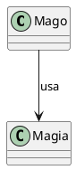
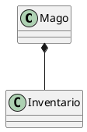

# Além da Herança: Outros Relacionamentos Entre Classes

A herança ("*é um*") é um dos pilares da Orientação a Objetos, mas não é a única forma pela qual as classes podem se relacionar. Na verdade, o relacionamento mais fundamental é o de **Associação** (um objeto "usa" ou "interage com" outro).

A Associação, em seu sentido mais amplo, pode ser refinada. Como a imagem que você encontrou ilustra, existem formas mais específicas de associação que denotam posse: a **Agregação** (que representa um relacionamento "tem um") e a **Composição** (que representa um relacionamento de posse mais forte, "é parte de").

Esses relacionamentos descrevem como os objetos *interagem*, *usam* ou *possuem* uns aos outros. Se um `Mago` lança uma `Magia`, temos uma associação geral. Se um `Mago` *obtém* um `Item`, temos uma associação mais específica de **Agregação**. Se um `Mago` *possui* algo que faz parte de sua definição, temos uma associação de **Composição**.

Vamos explorar a **Associação** em seu sentido mais geral (o "uso") e, em seguida, suas duas formas especializadas de posse: a **Agregação** e a **Composição**.

Esses relacionamentos descrevem como os objetos *interagem* ou *usam* uns aos outros. Se um `Mago` lança uma `Magia`, qual é o relacionamento entre eles? Se um `Mago` *tem* um `Item`, como representamos isso?

Vamos explorar esses três tipos principais.

---

### 1. Associação (Usa um)

A **Associação** é o relacionamento mais fraco. Ela representa que uma classe "usa" outra classe, mas não há posse ou dependência de ciclo de vida.

Um objeto é frequentemente passado como parâmetro para um método de outro, ou é instanciado localmente dentro de um método, usado e descartado.

**Exemplo de RPG:**
Um `Mago` pode lançar uma `Magia`. A classe `Mago` *usa* a classe `Magia`. O `Mago` não "possui" a `Magia` (a magia é um conceito), ele apenas a executa.

**Diagrama UML:**
Uma linha sólida com uma seta aberta indica a direção do "uso".



**Código C++:**
Note como o objeto `Magia` (ou `BolaDeFogo`) é criado *dentro* do método, ou recebido como parâmetro. O `Mago` não o armazena como um atributo.

```cpp
#include <iostream>
#include <string>

class Magia {
public:
    virtual void executar() = 0; // Abstrato
};

class BolaDeFogo : public Magia {
public:
    void executar() override {
        std::cout << "Bola de Fogo explode!" << std::endl;
    }
};

class Mago {
public:
    // Exemplo 1: Recebendo a magia como parâmetro
    void lancar(Magia* magia) {
        std::cout << "Mago prepara o feitiço..." << std::endl;
        magia->executar();
    }
    
    // Exemplo 2: Instanciando a magia localmente
    void lancarBolaDeFogo() {
        BolaDeFogo bola; // Criada na pilha
        std::cout << "Mago cria uma bola de fogo..." << std::endl;
        bola.executar();
    } // 'bola' é destruída aqui
};
```

---

### 2. Agregação (Tem um)

A **Agregação** é um tipo especial de associação que representa posse: um relacionamento "tem um".

A classe "todo" (o `Mago`) possui uma referência (geralmente um ponteiro) para a classe "parte" (o `Item`). No entanto, o ciclo de vida da "parte" **não** está atrelado ao "todo".

**Exemplo de RPG:**
Um `Mago` "tem um" `Item` (como um cajado ou amuleto). O `Mago` usa o `Item` para melhorar suas magias. No entanto, se o `Mago` morrer, o `Item` pode "dropar no chão" — ele pode existir independentemente do `Mago`. O `Item` pode até ser compartilhado ou trocado.

**Diagrama UML:**
Uma linha sólida com um **diamante vazio** do lado do "todo" (o dono).

```plantuml
@startuml
skinparam classAttributeIconSize 0
hide emptyMembers

class Mago
class Item

' O Mago "tem um" Item
Mago o-- Item
@enduml
```



**Código C++:**
O `Mago` armazena um **ponteiro** para o `Item`. Ele não é responsável por criar ou destruir o `Item` — ele apenas o "equipa" (recebe o ponteiro de fora).

```cpp
#include <iostream>
#include <string>

class Item {
public:
    int bonusMagico;
    std::string nomeItem;
    
    Item(std::string nome, int bonus) : nomeItem(nome), bonusMagico(bonus) {}

    void brilhar() {
        std::cout << nomeItem << " brilha com poder!" << std::endl;
    }
};

class Mago {
private:
    Item* itemEquipado; // Armazena um ponteiro

public:
    Mago() : itemEquipado(nullptr) {}

    // O Mago recebe o item de uma fonte externa
    void equiparItem(Item* item) {
        this->itemEquipado = item;
        if(item != nullptr) {
            std::cout << "Mago equipou o " << item->nomeItem << "." << std::endl;
        } else {
            std::cout << "Mago desequipou o item." << std::endl;
        }
    }
    
    void lancarMagiaForte() {
        int poderBase = 10;
        if (itemEquipado != nullptr) {
            itemEquipado->brilhar();
            int poderTotal = poderBase + itemEquipado->bonusMagico;
            std::cout << "Mago lanca magia com poder " << poderTotal << "!" << std::endl;
        } else {
            std::cout << "Mago lanca magia com poder " << poderBase << "." << std::endl;
        }
    }
    
    // O destrutor do Mago NÃO deleta o item!
    ~Mago() {
        std::cout << "Mago morre, mas o item continua existindo..." << std::endl;
    }
};

int main() {
    // Os itens existem fora do Mago
    Item* cajado = new Item("Cajado de Fogo", 5);
    Item* amuleto = new Item("Amuleto de Agua", 3);
    
    Mago* m = new Mago();
    m->lancarMagiaForte(); // Lança sem item
    
    m->equiparItem(cajado); // Equipa o cajado
    m->lancarMagiaForte(); // Lança com o cajado
    
    m->equiparItem(amuleto); // Troca pelo amuleto
    m->lancarMagiaForte(); // Lança com o amuleto
    
    std::cout << "--- Mago e deletado ---" << std::endl;
    delete m; // O Mago morre...
    
    // ... mas os itens continuam existindo!
    std::cout << "O item " << cajado->nomeItem << " ainda esta no chao." << std::endl;
    
    // Precisamos liberar a memória dos itens separadamente
    delete cajado;
    delete amuleto;
    
    return 0;
}
```
---

### 3. Composição (É parte de)

A **Composição** é a forma mais forte de posse. É um relacionamento "é parte de" ou "é composto por".

Ela também é um "tem um", mas com uma regra crucial: o ciclo de vida da "parte" é **totalmente controlado** pelo "todo". Se o "todo" é destruído, a "parte" é destruída junto. A "parte" não pode existir sem o "todo".

**Exemplo de RPG:**
Um `Mago` "é composto por" um `Inventario`. O `Inventario` de um Mago específico não faz sentido existir sem aquele `Mago`. Quando o `Mago` é criado, seu `Inventario` é criado junto. Quando o `Mago` morre (é destruído), seu `Inventario` deixa de existir.

**Diagrama UML:**
Uma linha sólida com um **diamante preenchido** do lado do "todo".



**Código C++:**
O `Inventario` é (geralmente) um **objeto membro** (não um ponteiro) da classe `Mago`. O construtor do `Mago` automaticamente chama o construtor do `Inventario`, e o destrutor do `Mago` automaticamente chama o destrutor do `Inventario`.

```cpp
#include <iostream>
#include <string>

class Inventario {
private:
    int numSlots = 10;
public:
    Inventario() { // Construtor
        std::cout << "(Inventario criado com " << numSlots << " slots)" << std::endl;
    }
    ~Inventario() { // Destrutor
        std::cout << "(Inventario destruido, itens perdidos)" << std::endl;
    }
    
    void guardarItem(std::string item) {
        std::cout << item << " guardado no inventario." << std::endl;
    }
};

class Mago {
private:
    Inventario meuInventario; // Objeto membro (Composição)
    std::string nome;

public:
    // Quando o Mago é construído, o meuInventario é construído primeiro
    Mago(std::string nome) : nome(nome) {
        std::cout << "Mago " << nome << " foi criado." << std::endl;
        meuInventario.guardarItem("Pocao");
    }
    
    // Quando o Mago é destruído, o meuInventario é destruído logo em seguida
    ~Mago() {
        std::cout << "Mago " << nome << " foi destruido." << std::endl;
    }
    
    void verItens() {
        // ...
    }
};

int main() {
    std::cout << "--- Criando Mago ---" << std::endl;
    Mago* g = new Mago("Gandalf");
    std::cout << "--- Deletando Mago ---" << std::endl;
    delete g;
    std::cout << "--- Fim do Programa ---" << std::endl;
    
    /* Saída:
    --- Criando Mago ---
    (Inventario criado com 10 slots)
    Mago Gandalf foi criado.
    Pocao guardado no inventario.
    --- Deletando Mago ---
    Mago Gandalf foi destruido.
    (Inventario destruido, itens perdidos)
    --- Fim do Programa ---
    */
    return 0;
}
```
